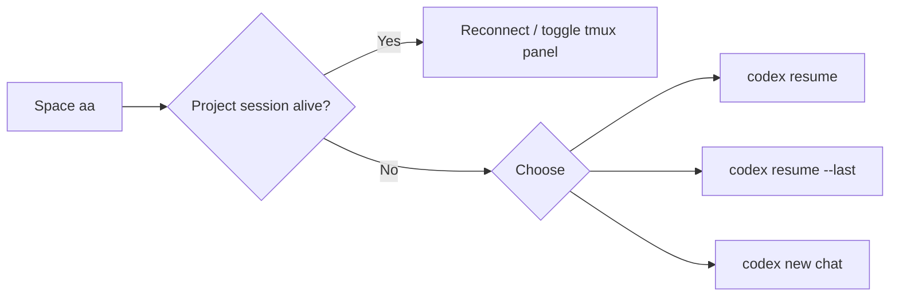

<div align="center">

# Nvim Agent Workbench

**A project-aware Neovim IDE where Codex conversations survive editor restarts.**

[](https://github.com/shanxierdan/nvim-agent-workbench/actions/workflows/ci.yml)
[](LICENSE)
[](https://neovim.io/)
[](https://github.com/openai/codex)

[简体中文](README.zh-CN.md)

</div>

<p align="center">
  
</p>

<p align="center"><sub>One workspace for project navigation, editing, and a persistent Codex conversation.</sub></p>

Nvim Agent Workbench turns LazyVim into a focused IDE with a persistent Codex panel. It keeps one agent session per project, reconnects through tmux, restores saved chats when the process is gone, and sends files, selections, diagnostics, and review prompts without leaving Neovim.

## Why this exists

Most terminal-agent setups open a new chat every time, lose the session when the editor exits, or let file pickers overwrite the agent split. This configuration handles those edges as one workflow:

- **Project-scoped sessions**: each working directory gets its own Codex/tmux session.
- **Resume-first startup**: reconnect a live session; otherwise choose history, latest, or new.
- **IDE context actions**: attach a file or selection, fix diagnostics, and request reviews.
- **Protected layout**: the editor always keeps a file window beside the agent panel.
- **Fast session lookup**: targeted `tmux has-session` checks avoid full process scans.
- **Practical WSL support**: Windows clipboard integration and system PDF opening.
- **Polished workbench UI**: Catppuccin, a useful dashboard, project title bar, LSP, DAP, tests, and Git tools.



## Requirements

- [Neovim 0.11.2+](https://github.com/neovim/neovim/releases)
- [Git](https://git-scm.com/), [tmux](https://github.com/tmux/tmux), and a [Nerd Font](https://www.nerdfonts.com/)
- [OpenAI Codex CLI](https://github.com/openai/codex)
- Recommended: `ripgrep`, `fd`, `curl`, `unzip`, a C compiler, and `make`

Install Codex on Linux or macOS using its official installer:

```bash
curl -fsSL https://chatgpt.com/codex/install.sh | sh
codex
```

The first `codex` run lets you sign in with ChatGPT.

## One-command install

The installer backs up an existing `~/.config/nvim` before cloning and then synchronizes the pinned plugins.

```bash
curl -fsSL https://raw.githubusercontent.com/shanxierdan/nvim-agent-workbench/main/install.sh | bash
```

Review before running a remote script:

```bash
curl -fsSL https://raw.githubusercontent.com/shanxierdan/nvim-agent-workbench/main/install.sh -o /tmp/nvim-agent-install.sh
less /tmp/nvim-agent-install.sh
bash /tmp/nvim-agent-install.sh
```

Then open a project from its root:

```bash
cd path/to/project
nvim .
```

### Isolated install

Try the workbench without replacing your current Neovim configuration:

```bash
curl -fsSL https://raw.githubusercontent.com/shanxierdan/nvim-agent-workbench/main/install.sh \
  | bash -s -- --app-name nvim-agent-workbench
NVIM_APPNAME=nvim-agent-workbench nvim
```

## Codex workflow

`<leader>` is `Space`.

| Key | Action |
| --- | --- |
| `Space aa` | Reconnect/toggle Codex; show the resume menu when no process is alive |
| `Space an` | Start a new chat (`/new` when Codex is already running) |
| `Space ah` | Choose a saved chat (`/resume` when Codex is already running) |
| `Space al` | Continue the latest chat |
| `Ctrl-.` | Move focus between code and Codex |
| `Space af` | Attach the current file to the Codex composer |
| Visual `Space as` | Attach the selected code |
| `Space ad` | Ask Codex to fix current diagnostics and run checks |
| `Space ar` | Review the current file for bugs and missing tests |
| `Space ap` | Choose a prompt/context preset |
| `Space ax` | Detach the Neovim panel from its tmux session |

Attaching context does not submit it immediately. Add your instruction in the Codex composer and press Enter.

## Everyday IDE keys

| Key | Action |
| --- | --- |
| `Space e` | File explorer |
| `Space Space` | Find files |
| `Space /` | Search project text |
| `Space ,` | Switch buffers |
| `gd` / `gr` | Definition / references |
| `K` | Documentation hover |
| `Space ca` | Code action |
| `Space cr` | Rename symbol |
| `Space cf` | Format |
| `Space xx` | Diagnostics |
| `Space gg` | Lazygit |
| `Space db` / `Space dc` | Breakpoint / debug continue |
| `Space tt` | Run the nearest or last test |

On WSL, press `O` on a file in the explorer to open it with Windows. PDFs prefer Microsoft Edge and fall back to the Windows default application.

## Language

The UI and agent prompts follow a Chinese locale automatically and otherwise use English. Override this before starting Neovim:

```bash
export NVIM_AGENT_LANGUAGE=zh  # or en
```

## Health and maintenance

```bash
~/.config/nvim/scripts/doctor.sh
```

Inside Neovim, run `:LazyHealth`, `:checkhealth sidekick`, and `:Mason` after the first launch.

Update:

```bash
git -C ~/.config/nvim pull --ff-only
nvim --headless "+Lazy! sync" +qa!
```

Restore the backup printed by the installer:

```bash
mv ~/.config/nvim ~/.config/nvim.workbench
mv ~/.config/nvim.bak.YYYYMMDD-HHMMSS ~/.config/nvim
```

## Design notes

- Plugin revisions are committed in `lazy-lock.json` for reproducibility.
- Codex credentials and `~/.codex` are never part of this repository.
- Sidekick's next-edit suggestions are disabled; this setup uses only its CLI integration and does not require GitHub Copilot.
- The tmux session keeps a running process alive. `codex resume` restores chats after the process or machine has stopped.

## Development

```bash
make lint
make smoke
```

See [CONTRIBUTING.md](CONTRIBUTING.md) and [SECURITY.md](SECURITY.md).

## Credits

Built on [LazyVim](https://www.lazyvim.org/), [Sidekick.nvim](https://github.com/folke/sidekick.nvim), [Snacks.nvim](https://github.com/folke/snacks.nvim), [Catppuccin](https://github.com/catppuccin/nvim), and [OpenAI Codex](https://github.com/openai/codex).

Licensed under the [Apache License 2.0](LICENSE).
