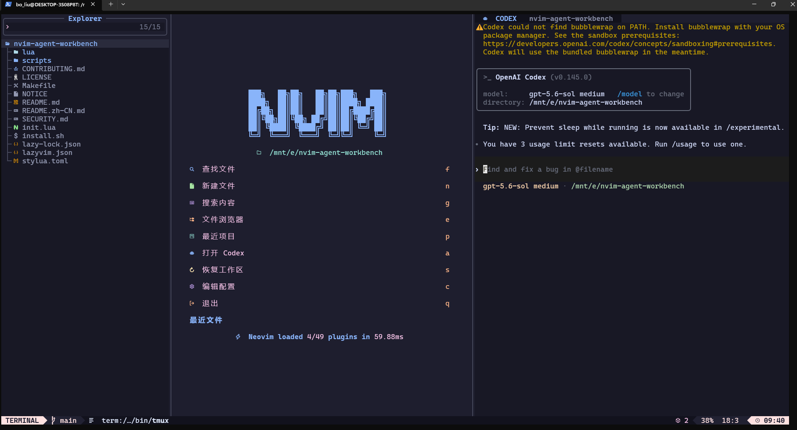
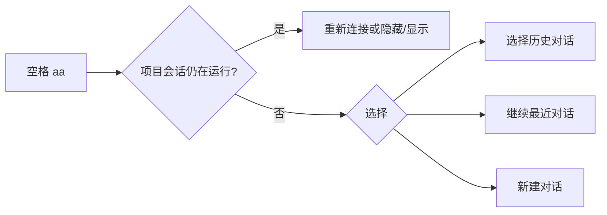

<div align="center">

# Nvim Agent Workbench

**一个以项目为中心、可以让 Codex 对话跨 Neovim 重启延续的终端 IDE。**

[](https://github.com/shanxierdan/nvim-agent-workbench/actions/workflows/ci.yml)
[](LICENSE)
[](https://neovim.io/)
[](https://github.com/openai/codex)

[English](README.md)

</div>

<p align="center">
  
</p>

<p align="center"><sub>在同一个工作区中完成项目浏览、代码编辑和可持续恢复的 Codex 对话。</sub></p>

Nvim Agent Workbench 将 LazyVim、Sidekick、tmux 和 Codex CLI 组合成一套完整工作流：每个项目拥有独立的 Agent 会话，退出 Neovim 后进程仍可保留；进程结束后可以恢复历史对话；文件、选区、诊断和审查上下文都能直接发送给 Codex。

## 解决的问题

- **项目级会话**：不同工作目录不会串用同一个 Codex。
- **恢复优先**：优先接回仍在运行的 tmux 会话，否则选择历史、最近或新对话。
- **IDE 上下文**：一键附加文件、选区和诊断信息。
- **稳定分屏**：始终为代码保留编辑窗口，文件选择器不会占用 Codex 面板。
- **快速检测**：通过定向 `tmux has-session` 查询，避免全量扫描进程。
- **WSL 适配**：Windows 剪贴板、PDF 与系统文件打开。
- **完整 IDE 能力**：LSP、格式化、调试、测试、Git、文件搜索和精心设计的工作台 UI。



## 环境要求

- [Neovim 0.11.2+](https://github.com/neovim/neovim/releases)
- [Git](https://git-scm.com/)、[tmux](https://github.com/tmux/tmux) 和 [Nerd Font](https://www.nerdfonts.com/)
- [OpenAI Codex CLI](https://github.com/openai/codex)
- 建议安装：`ripgrep`、`fd`、`curl`、`unzip`、C 编译器和 `make`

Linux/macOS 可使用 Codex 官方安装器：

```bash
curl -fsSL https://chatgpt.com/codex/install.sh | sh
codex
```

首次运行 `codex` 时选择使用 ChatGPT 登录。

## 一键安装

安装器会先把已有的 `~/.config/nvim` 移动到带时间戳的备份目录，再克隆配置并同步锁定版本的插件。

```bash
curl -fsSL https://raw.githubusercontent.com/shanxierdan/nvim-agent-workbench/main/install.sh | bash
```

随后从项目根目录启动：

```bash
cd /path/to/project
nvim .
```

不替换现有配置的隔离安装方式：

```bash
curl -fsSL https://raw.githubusercontent.com/shanxierdan/nvim-agent-workbench/main/install.sh \
  | bash -s -- --app-name nvim-agent-workbench
NVIM_APPNAME=nvim-agent-workbench nvim
```

## Codex 快捷键

`<leader>` 是空格键。

| 快捷键 | 功能 |
| --- | --- |
| `Space aa` | 接回或隐藏/显示 Codex；没有活动进程时显示恢复菜单 |
| `Space an` | 新建对话；Codex 已运行时使用 `/new` |
| `Space ah` | 选择历史对话；Codex 已运行时使用 `/resume` |
| `Space al` | 继续当前项目最近一次对话 |
| `Ctrl-.` | 在代码区与 Codex 之间切换焦点 |
| `Space af` | 把当前文件附加到 Codex 输入框 |
| 选中后 `Space as` | 附加选中的代码 |
| `Space ad` | 让 Codex 修复当前诊断并运行检查 |
| `Space ar` | 审查当前文件的错误、回归和缺失测试 |
| `Space ap` | 选择提示和上下文预设 |
| `Space ax` | 将 Neovim 面板与 tmux 会话分离 |

附加上下文不会立即发送。可以继续在 Codex 输入框中补充具体要求，然后按回车。

## 常用 IDE 快捷键

| 快捷键 | 功能 |
| --- | --- |
| `Space e` | 文件浏览器 |
| `Space Space` | 查找文件 |
| `Space /` | 搜索项目文本 |
| `Space ,` | 切换已打开文件 |
| `gd` / `gr` | 跳转定义 / 查找引用 |
| `K` | 显示文档 |
| `Space ca` | 代码操作 |
| `Space cr` | 重命名符号 |
| `Space cf` | 格式化 |
| `Space xx` | 诊断列表 |
| `Space gg` | Lazygit |
| `Space db` / `Space dc` | 设置断点 / 继续调试 |
| `Space tt` | 运行测试 |

在 WSL 文件浏览器中选中文件后按 `O`，会交给 Windows 打开。PDF 优先使用 Microsoft Edge，否则使用系统默认应用。

## 语言

中文区域设置会自动使用中文，其他环境默认英文，也可以强制指定：

```bash
export NVIM_AGENT_LANGUAGE=zh  # 或 en
```

## 检查与维护

```bash
~/.config/nvim/scripts/doctor.sh
```

首次进入后建议运行 `:LazyHealth`、`:checkhealth sidekick` 和 `:Mason`。

更新配置：

```bash
git -C ~/.config/nvim pull --ff-only
nvim --headless "+Lazy! sync" +qa!
```

恢复安装器生成的备份：

```bash
mv ~/.config/nvim ~/.config/nvim.workbench
mv ~/.config/nvim.bak.YYYYMMDD-HHMMSS ~/.config/nvim
```

## 设计说明

- `lazy-lock.json` 固定插件版本，保证安装结果可复现。
- 仓库不包含 Codex 凭据、对话记录或 `~/.codex`。
- Sidekick 的 NES 功能已关闭，仅使用 CLI 集成，因此不需要 GitHub Copilot。
- tmux 保存仍在运行的进程；进程或电脑关闭后由 `codex resume` 恢复历史对话。

项目基于 [LazyVim](https://www.lazyvim.org/)、[Sidekick.nvim](https://github.com/folke/sidekick.nvim)、[Snacks.nvim](https://github.com/folke/snacks.nvim)、[Catppuccin](https://github.com/catppuccin/nvim) 和 [OpenAI Codex](https://github.com/openai/codex)。采用 [Apache License 2.0](LICENSE)。
